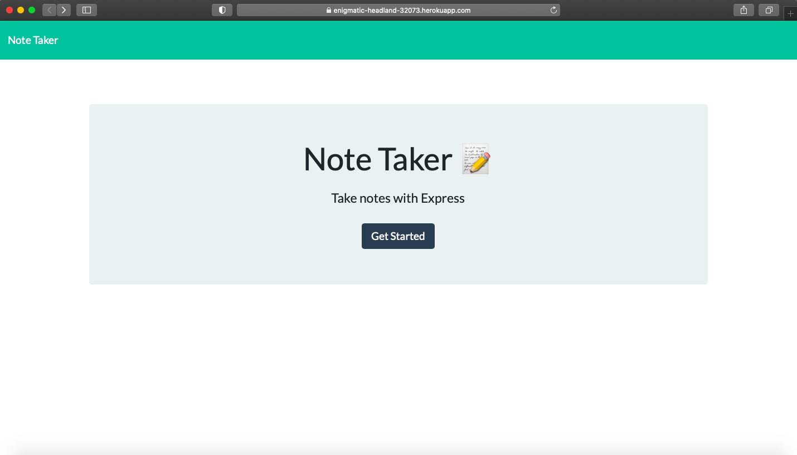
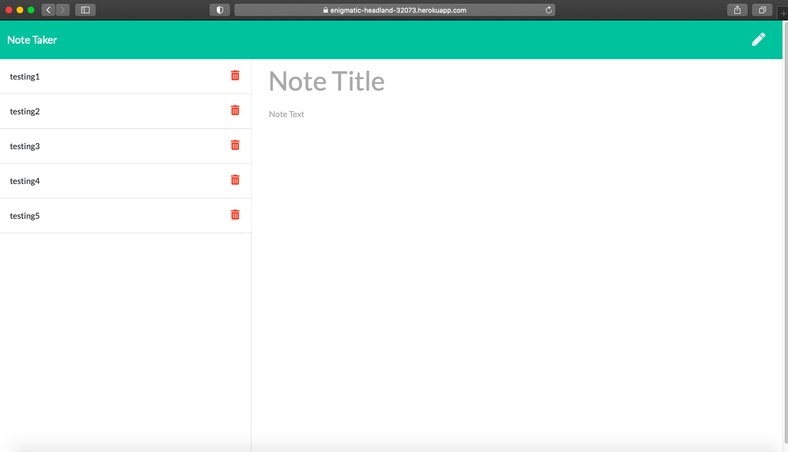

## note-taker

## Overview:

For this unit, we continue to gain the relevant skillset(s) to create back-end web applications. Express is a web app that allows us to do just that.
Per the instructions for this week's assignment, we were to create an application that can be used to write, save, and delete notes. Again, this application uses an express backend and saves and retrieves note data from the provided JSON file.

Please find additional information regarding this project below. Thank you.

## Video of Application User Flow

## Deployed Webpage Link

Please find the deployed webpage link here: https://enigmatic-headland-32073.herokuapp.com/notes

## Screenshots of Deployed Application

## Credits

1. Node.js: https://nodejs.dev/learn/the-nodejs-fs-module

2. Express: https://expressjs.com/

3. NPM - UUID: https://www.npmjs.com/package/uuid

4. MDN web docs: https://developer.mozilla.org/en-US/docs/Web/CSS

## MIT License

Copyright (c) [2020] [Adebambo Adeshiyan]

Permission is hereby granted, free of charge, to any person obtaining a copy
of this software and associated documentation files (the "Software"), to deal
in the Software without restriction, including without limitation the rights
to use, copy, modify, merge, publish, distribute, sublicense, and/or sell
copies of the Software, and to permit persons to whom the Software is
furnished to do so, subject to the following conditions:

The above copyright notice and this permission notice shall be included in all
copies or substantial portions of the Software.

THE SOFTWARE IS PROVIDED "AS IS", WITHOUT WARRANTY OF ANY KIND, EXPRESS OR
IMPLIED, INCLUDING BUT NOT LIMITED TO THE WARRANTIES OF MERCHANTABILITY,
FITNESS FOR A PARTICULAR PURPOSE AND NONINFRINGEMENT. IN NO EVENT SHALL THE
AUTHORS OR COPYRIGHT HOLDERS BE LIABLE FOR ANY CLAIM, DAMAGES OR OTHER
LIABILITY, WHETHER IN AN ACTION OF CONTRACT, TORT OR OTHERWISE, ARISING FROM,
OUT OF OR IN CONNECTION WITH THE SOFTWARE OR THE USE OR OTHER DEALINGS IN THE
SOFTWARE.
